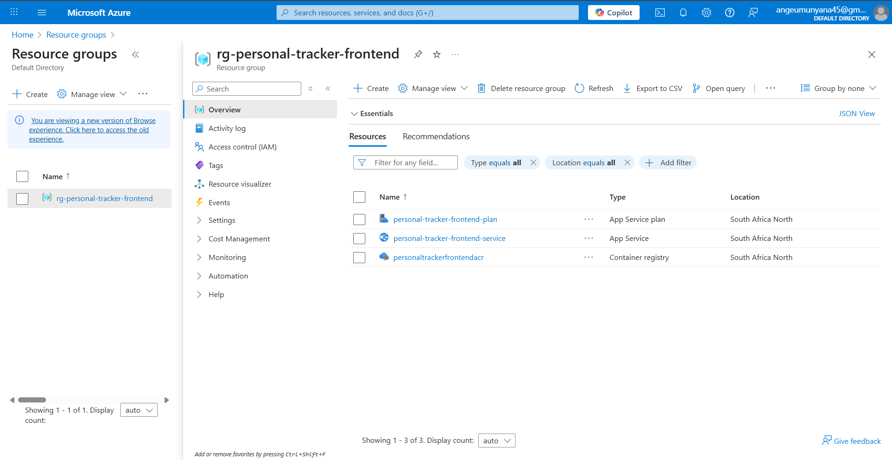
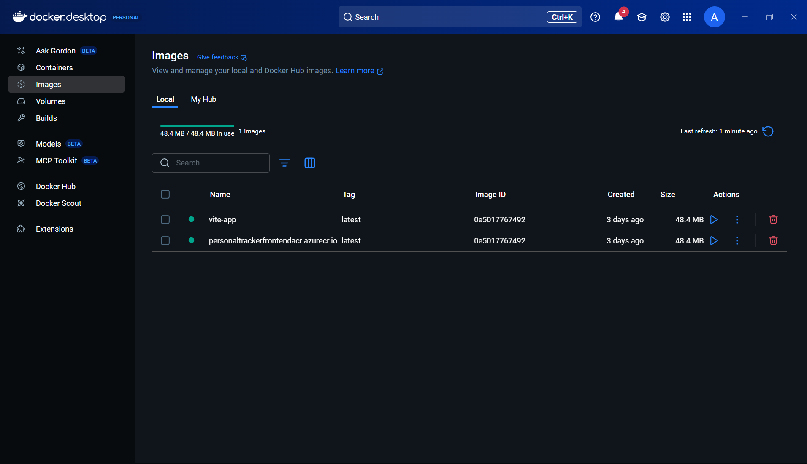
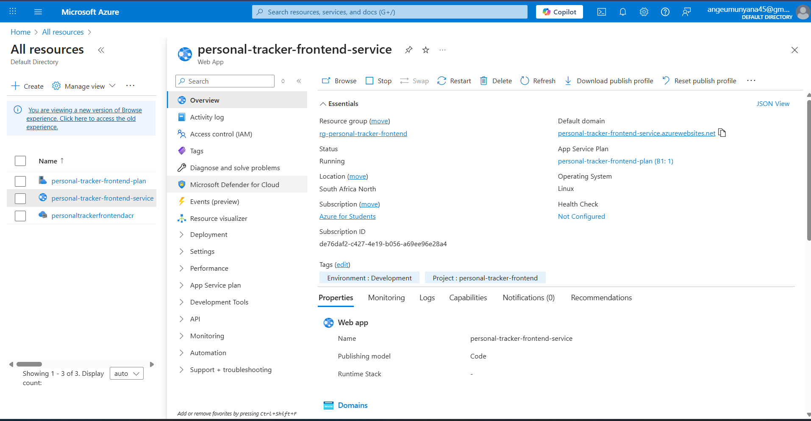

### 📄 `phase.md`

## 🌍 Live Public URL

**URL:** [https://personal-tracker-frontend-service.azurewebsites.net/]https://personal-tracker-frontend-service.azurewebsites.net/)

---

## 📷 Screenshots of Successfully Provisioned Resources

### Azure Container Registry

### Container Instance Running

### Terraform Output

---

## 🔁 Peer Review

**Pull Request Reviewed:** [https://github.com/mbienaimee/todo-devops/pull/27](https://github.com/mbienaimee/todo-devops/pull/27)

---

## 💬 Reflection: Challenges of IaC and Manual Deployment

Implementing Infrastructure as Code (IaC) with Terraform was both empowering and challenging. One of the biggest challenges was managing the dependencies and resource provisioning order — for example, ensuring that the container registry (ACR) was created before pushing the Docker image to it.

Understanding how networking (VNet, subnets, firewall rules) ties into container service accessibility also required careful attention. Misconfiguring these caused early failed deployments and connectivity issues.

The manual deployment process, while useful for learning, was more error-prone than expected. Tagging images consistently, logging into ACR correctly, and setting up the container service to pull the right image were all steps where small mistakes caused delays. Additionally, setting environment variables and ports manually through the Azure UI or CLI introduced potential for misconfiguration.

This experience reinforced the importance of automation. While Terraform helped codify the infrastructure, deploying the container manually made it clear why CI/CD pipelines are essential in real-world DevOps setups. Going forward, I would automate the image build/push and service deployment using GitHub Actions or Azure DevOps.

